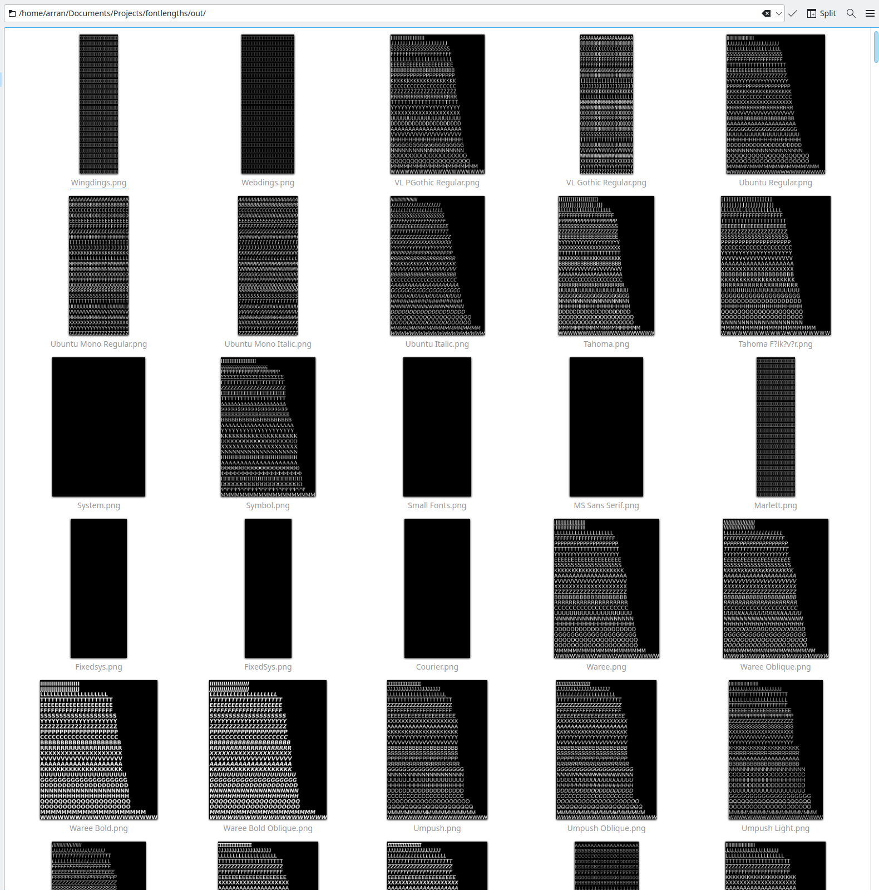

# Font length generator

Doing important procrastination right now. Idea from: https://twitter.com/FreyaHolmer/status/1776007184117063807

Generates a PNG with 20x of each of A-Z lines, and sorts them by pixel length.... For each font on your system. 

Results:


`x` many:



Download executable:
https://github.com/arran4/golang-wordwrap/releases

Donwload pre-run results: Look for "premade.zip" in:
https://github.com/arran4/golang-wordwrap/releases

Want to increase the fonts in `premade.zip` modify:
[goreleaser.yml](.github/workflows/goreleaser.yml)

Currently adding fonts using:
```
            sudo apt install -y fonts-freefont-ttf fonts-freefont-otf xfonts-100dpi
```
